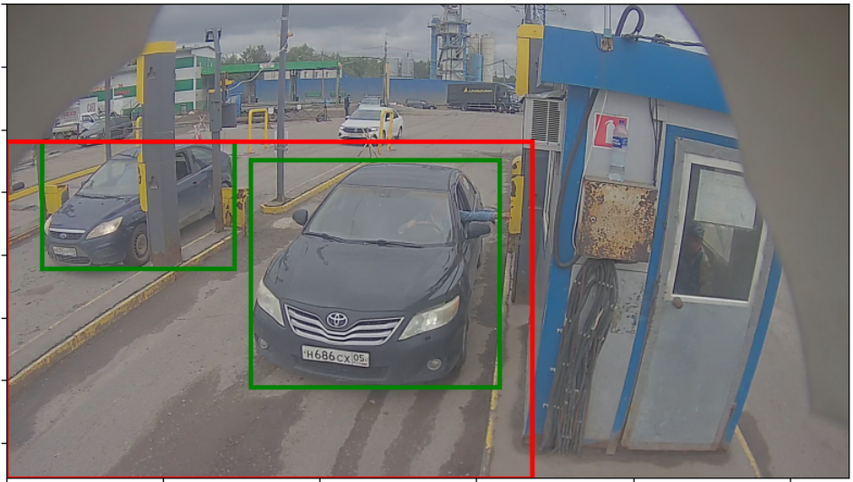
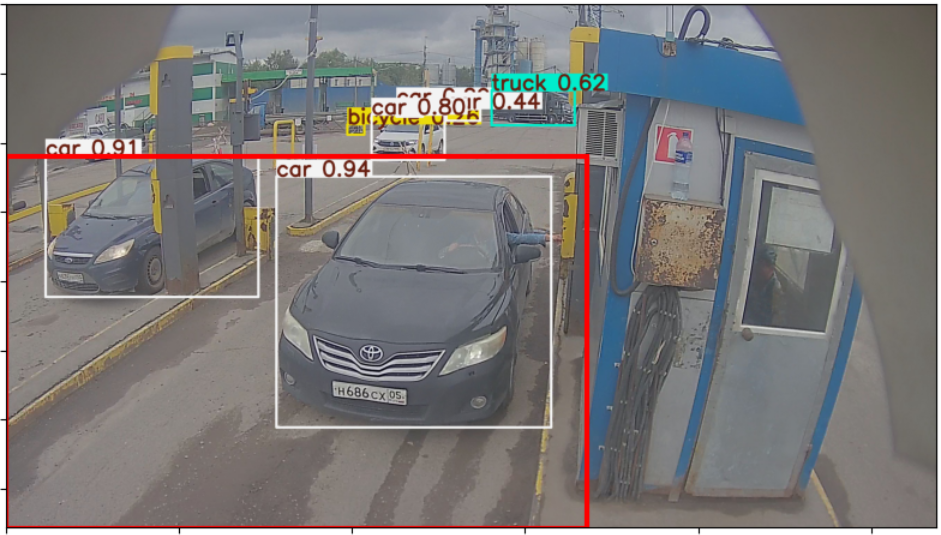

# CV_detection_car_test
CV_detection_car_test

## Задача

Программа должна получать на вход видеофайл и в режиме реального времени детектировать наличие
транпорта. Задача заключается в обнаружении автомобилей исключительно в зоне перед шлагбаумом. Поскольку видеокамера зафиксирована и её положение неизменно, целесообразно ограничить область распознавания, задав зону интереса. Любые транспортные средства, попадающие в данную зону, будут отображаться системой, остальные — игнорироваться.

## Процесс
В качестве инструмента используется предварительно обученная модель `YOLOv8X`, обеспечивающая высокую точность обнаружения объектов. Я ограничил классификацию всего двумя категориями: **легковыми** и **грузовыми** автомобилями, поскольку именно они представляют интерес для задания.

Процесс обработки реализуется следующим образом: 
* Видеопоток разбивается на отдельные кадры
* Каждый кадр подается на вход модели 
* В цикле, извлекаются интересующие нас объекты и заносятся в специальный список, предназначенный для последующей визуализации. 

## Дополнение

**Я не учел это сразу и подумал уже после детекции, но тут напишу:**   
Для повышения производительности системы рекомендуется установить порог достоверности выше 60%, исключив таким образом лишние вычисления над объектами вне зоны интереса. Так как несмотря на то, что мы отрисовываем только нужные нам координаты, считаются и все равно все, как на картинке:

Завершающим этапом является наложение обнаруженных координат непосредственно на исходное видео, формируя итоговую картину наблюдаемого пространства.

## Ссылки

* ***[Код для запуска детекции](detection.py)***
* ***[Ноутбук с предобработкой картинок](prediction.ipynb)***

##
